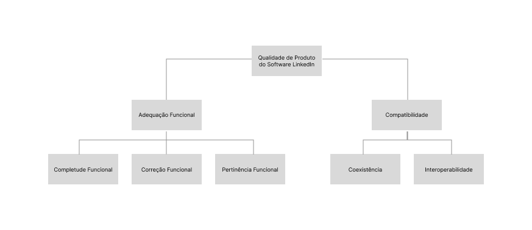

# Fase 1 - Projeto Final

## 1. Propósito e Uso Pretendido da Avaliação do App

O propósito desta avaliação é fundamental para garantir que o <b>aplicativo móvel do LinkedIn</b> ofereça uma experiência de alta qualidade aos seus usuários e atenda aos requisitos de qualidade da disciplina de Qualidade de Software 1 da <b>Universidade de Brasília (UnB)</b>.

---

### 1.1 Por Que Avaliar o LinkedIn?

A avaliação do LinkedIn é essencial por vários motivos:

<ol style="text-align: justify; padding-left: 4em; margin-top: 0.5em;">
<li><b>Validação da Qualidade Acadêmica</b>: Para a matéria de Qualidade de Software 1, esta avaliação serve como um exercício prático para aplicar os conceitos e métricas de qualidade aprendidos, demonstrando a capacidade de analisar e julgar sistemas reais.
<li><b>Identificação de Oportunidades de Melhoria</b>: Embora o LinkedIn seja um aplicativo estabelecido, toda aplicação possui pontos de atrito. A avaliação visa identificar <b>deficiências</b> e <b>pontos fortes</b> específicos nas áreas de qualidade selecionadas, permitindo sugestões de melhorias.
<li><b>Garantia da Experiência do Usuário (UX)</b>: No mercado competitivo de redes profissionais, a qualidade do software impacta diretamente a retenção e a satisfação do usuário. Avaliar a qualidade é uma forma de garantir que o aplicativo continue a ser uma ferramenta eficaz e sem frustrações para o desenvolvimento de carreira.
</ol>

---

### 1.2 Tópicos de Qualidade Focais

Esta avaliação será focada em dois atributos críticos de qualidade, conforme definido pela <b>ISO/IEC 25010 (SQuaRE)</b>:

#### 1.2.1 Adequação Funcional

<ul style="text-align: justify; padding-left: 4em; margin-top: 0.5em;">
<li><b>O que será avaliado</b>: A eficácia das principais funcionalidades do LinkedIn para que os profissionais atinjam seus objetivos de carreira.
<li><b>Foco Principal</b>: Serão examinadas as ferramentas centrais, como:
    <li>A <b>eficiência e relevância</b> dos algoritmos de <b>busca de emprego</b>.
    <li>A usabilidade e o sucesso das ferramentas de <b>networking</b> (conexão, mensagens).
    <li>A facilidade e o alcance da <b>publicação e consumo de conteúdo</b> profissional.
<li><b>Pergunta-chave</b>: O LinkedIn entrega de forma completa e correta as funções necessárias para o sucesso profissional de seus usuários?
</ul>

#### 1.2.2 Compatibilidade (Coexistência)

<ul style="text-align: justify; padding-left: 4em; margin-top: 0.5em;">
<li><b>O que será avaliado</b>: A capacidade do aplicativo de operar de maneira eficiente e estável no ambiente comum de um smartphone, onde compartilha recursos com inúmeras outras aplicações.
<li><b>Foco Principal</b>: Análise de como o aplicativo se comporta em termos de:
    <li><b>Consumo de recursos</b> (memória, bateria, dados).
    <li><b>Estabilidade</b> e ausência de falhas que impactem outros aplicativos.
    <li><b>Integração</b> com ecossistemas externos (por exemplo, login com outras plataformas ou o compartilhamento de dados com ferramentas de recrutamento).
<li><b>Pergunta-chave</b>: O LinkedIn funciona harmoniosamente no ambiente operacional do usuário, sem causar impacto negativo em sua produtividade geral?
</ul>

---

### 1.3 Para Quem e Como os Resultados Serão Usados

#### 1.3.1 Para Quem

<ol style="text-align: justify; padding-left: 4em; margin-top: 0.5em;">
<li><b>O Corpo Docente da UnB (Professores e Avaliadores)</b>: Os resultados e a metodologia servirão como comprovação do aprendizado prático e da aplicação da teoria de Qualidade de Software.
<li><b>A Equipe de Desenvolvimento (Simulada)</b>: Os insights e as sugestões de melhoria podem ser direcionados a uma equipe fictícia do LinkedIn, como um exercício de comunicação de problemas e priorização de backlogs.
<li><b>Os Usuários Finais (Estudantes e Profissionais)</b>: Os resultados podem conscientizar os usuários sobre os pontos fortes e fracos do aplicativo, auxiliando-os a usá-lo de forma mais eficiente.
</ol>

#### 1.3.2 Uso Pretendido dos Resultados

<ul style="text-align: justify; padding-left: 4em; margin-top: 0.5em;">
<li><b>Relatório de Não-Conformidades (Acadêmico)</b>: Gerar um documento formal detalhando as falhas encontradas, as não-conformidades com os requisitos de qualidade (Adequação Funcional e Coexistência) e o impacto percebido no usuário.
<li><b>Sugestões de Refatoração e Melhoria</b>: Propor mudanças concretas no design e na arquitetura do aplicativo que poderiam otimizar as funcionalidades avaliadas e reduzir os conflitos de coexistência.
<li><b>Base para Testes Futuros</b>: Os resultados servirão como ponto de partida para a criação de cenários de testes mais robustos em projetos subsequentes, como testes de usabilidade aprofundados ou testes de performance em dispositivos variados.
</ul>

## 2. Requisitante e Partes Interessadas

Conforme solicitado, a identificação das partes envolvidas é o ponto de partida.

### 2.1 Requisitantes

A equipe de Gerenciamento de Produto do LinkedIn, com o objetivo de avaliar a qualidade das funcionalidades essenciais antes do lançamento de uma nova versão ou atualização.

### 2.2 Partes Interessadas
<ul style="text-align: justify; padding-left: 4em; margin-top: 0.5em;">
    <li><b>Candidatos a vagas (usuários finais)</b>: Buscam uma plataforma eficiente, confiável e segura para gerenciar suas carreiras e encontrar oportunidades.
    <li><b>Recrutadores e Empresas (clientes)</b>: Utilizam a plataforma para encontrar e contratar talentos, esperando que os perfis sejam detalhados e que as ferramentas de busca sejam precisas.
    <li><b>Desenvolvedores e Equipe de TI do LinkedIn</b>: Responsáveis por implementar, manter e garantir o funcionamento técnico da plataforma[cite: 19].
    <li><b>Operadores de Infraestrutura</b>: Garantem a disponibilidade e o desempenho da plataforma.
    <li><b>Acionistas do LinkedIn/Microsoft</b>: Interessados no crescimento, reputação e lucratividade da plataforma.
</ul>

## 3. Tipo de Produto e Descrição Estruturada do Software

### 3.1 Tipo de Produto

O LinkedIn é uma <b>plataforma de rede social profissional baseada na web e em aplicativos móveis (iOS/Android)</b>. Funciona como um sistema de software de grande porte, distribuído e orientado a serviços, operando em um modelo SaaS (Software as a Service).

### 3.2 Descrição Estruturada (Escopo Definido)

#### 3.2.1 Módulo 1: Gestão de Perfil Profissional

<ul style="text-align: justify; padding-left: 4em; margin-top: 0.5em;">
<li><b>Interfaces</b>: Interface de usuário para criação e edição de seções do perfil (experiência, formação acadêmica, competências, recomendações).
<li><b>Dependências</b>: Interage com o banco de dados de usuários, sistema de autenticação e, opcionalmente, com sistemas externos para importação de certificados.
</ul>

#### 3.2.2 Módulo 2: Busca e Candidatura a Vagas

<ul style="text-align: justify; padding-left: 4em; margin-top: 0.5em;">
<li><b>Interfaces</b>: Página de busca de vagas com filtros (cargo, localidade, tipo de contrato, etc.), interface de visualização de vagas e formulário de candidatura (simplificada ou completa).
<li><b>Dependências</b>: Conecta-se ao banco de dados de vagas, ao módulo de perfil do usuário (para preenchimento automático), a sistemas de rastreamento de candidatos (ATS) de empresas externas e a um motor de busca e recomendação.
</ul>

## 4. Modelo de Qualidade e Representação Gráfica

Para a avaliação de qualidade do software LinkedIn, foi adotado como referência o modelo de qualidade de produto definido pela norma **ISO/IEC 25010**, que faz parte do framework SQuaRE. A escolha deste modelo padrão se justifica por oferecer uma taxonomia consolidada e abrangente para a especificação dos requisitos de avaliação de um produto de software.

* **Adaptação do Modelo**: O modelo padrão foi adaptado para focar nos aspectos mais críticos do LinkedIn, considerando seu propósito e o escopo definido para esta avaliação. O propósito de avaliar a jornada do candidato a uma vaga orienta a seleção das características. Foram selecionadas duas características de qualidade de produto, com a exclusão explícita da característica Usabilidade, conforme a premissa do trabalho. As características escolhidas são:

    * **1. Adequação Funcional:** Refere-se à capacidade do software de prover funcionalidades que atendam às necessidades declaradas e implícitas do usuário.
        * **Completude Funcional:** Avalia se o conjunto de funções oferecidas é suficiente para a conclusão de tarefas essenciais (ex: preenchimento do perfil, candidatura a vagas).
        * **Correção Funcional:** Verifica se as funções produzem os resultados corretos (ex: filtros de busca retornam resultados precisos).
        * **Pertinência Funcional:** Examina se as funcionalidades disponíveis são apropriadas para os objetivos do usuário (ex: recomendações de vagas são pertinentes).

    * **2. Compatibilidade:** Refere-se à capacidade do produto de coexistir e trocar informações com outros sistemas, compartilhando o mesmo ambiente e recursos.
        * **Coexistência:** Avalia a capacidade do software de operar em seu ambiente sem impactar negativamente outros softwares (ex: uso de recursos de CPU e memória do navegador).
        * **Interoperabilidade:** Mede a capacidade de trocar informações com outros sistemas (ex: exportação de perfil para PDF ou integração com sistemas de recrutamento).

### 4.1 Representação Gráfica

A representação gráfica do modelo adaptado é fundamental para comunicar de forma clara a estrutura da avaliação. Ela é organizada em um diagrama hierárquico com a seguinte estrutura:

1.  **Nível 0 (Raiz):** O nó central, intitulado **"Qualidade de Produto do Software LinkedIn"**, que representa o objeto geral da avaliação.
2.  **Nível 1 (Características):** Duas ramificações principais que derivam da raiz, representando as características de alto nível selecionadas: **"Adequação Funcional"** e **"Compatibilidade"**.
3.  **Nível 2 (Subcaracterísticas):** Cada característica se decompõe em nós secundários.
    * *Adequação Funcional* desdobra-se em: `Completude Funcional`, `Correção Funcional` e `Pertinência Funcional`.
    * *Compatibilidade* desdobra-se em: `Coexistência` e `Interoperabilidade`.

Este diagrama representa visualmente o modelo de qualidade específico para a avaliação do LinkedIn, delimitando o escopo e a relação entre os atributos que serão analisados.

## 5. Seleção e Priorização de Características

Foram escolhidas 2 características de qualidade, com base no propósito da avaliação e no tipo de produto.

<ol style="text-align: justify; padding-left: 4em; margin-top: 0.5em;">

1. **Adequação Funcional (Prioridade Alta):**
    * **Justificativa:** A principal proposta de valor do LinkedIn reside na eficácia de suas ferramentas. Se a busca de vagas não retorna resultados relevantes (correção funcional), se o perfil não permite adicionar todas as informações necessárias (completude funcional) ou se a candidatura a uma vaga falha, a plataforma perde completamente seu propósito para o usuário. A adequação funcional é, portanto, a base para que os profissionais atinjam seus objetivos de carreira através do serviço.

2. **Compatibilidade (Coexistência) (Prioridade Alta):**
    * **Justificativa:** O LinkedIn não opera isoladamente; ele coexiste no ambiente digital do usuário (navegador com múltiplas abas, extensões) e se integra a um ecossistema profissional maior (sistemas de rastreamento de candidatos - ATS, plataformas de e-mail, etc.). É crucial que a plataforma funcione de forma eficiente sem consumir recursos excessivos que impactem negativamente outras aplicações. A capacidade de coexistir e interoperar sem conflitos garante uma experiência fluida e profissional.
    
</ol>

## 6. Escopo, Profundidade e Objetos de Avaliação

A definição clara do escopo é fundamental para a execução do projeto.

### 6.1 Objetos de Avaliação

<ul style="text-align: justify; padding-left: 4em; margin-top: 0.5em;">
* O processo de **edição e salvamento de informações** na seção "Experiência" do perfil.
* A funcionalidade de **busca de vagas**, aplicando pelo menos três filtros (ex: cargo, localidade e tipo de vaga).
* O fluxo de **candidatura simplificada** ("Easy Apply").
</ul>

### 6.2 Profundidade da Avaliação

<ul style="text-align: justify; padding-left: 4em; margin-top: 0.5em;">
<li><b>Adequação Funcional</b>: A análise verificará se os filtros de busca de vagas operam corretamente (Correção Funcional) e se o formulário de candidatura contém os campos essenciais para o processo (Completude Funcional)..
<li><b>Compatibilidade (Coexistência)</b>: Serão realizados testes de uso da plataforma em diferentes navegadores (ex: Chrome, Firefox com extensões ativas) para observar o consumo de recursos (CPU, memória) e verificar se há impacto negativo no desempenho de outras aplicações abertas simultaneamente.
</ul>

### 6.3 Fora do Escopo

<ul style="text-align: justify; padding-left: 4em; margin-top: 0.5em;">
<li>Funcionalidades de Networking: Mensagens, feed de notícias, criação de conteúdo.
<li>LinkedIn Learning: Plataforma de cursos.
<li>Recruiter e Sales Navigator: Ferramentas pagas para recrutadores e vendedores.
<li>Aplicativos Móveis: A avaliação se concentrará na versão web para desktop.
<li>Justificativa: Essas funcionalidades são complexas e sua avaliação exigiria um projeto separado. O foco atual está na jornada principal do candidato a emprego, que é o pilar da plataforma.
</ul>

## 7. ODS, Metas e Indicadores Relacionados

O software avaliado se conecta com os seguintes Objetivos de Desenvolvimento Sustentável (ODS) da ONU:

### 7.1 ODS 8: Trabalho Decente e Crescimento Econômico

<ul style="text-align: justify; padding-left: 4em; margin-top: 0.5em;">
<li>Justificativa do Vínculo: O LinkedIn é uma ferramenta global que visa promover o emprego pleno e produtivo. Ele conecta diretamente profissionais a oportunidades de trabalho, facilitando o acesso ao mercado e fomentando o crescimento econômico.
<li>Metas Associadas:
        <li>Meta 8.5: "Até 2030, alcançar o emprego pleno e produtivo e trabalho decente para todas as mulheres e homens, inclusive para os jovens e as pessoas com deficiência, e remuneração igual para trabalho de igual valor."
        <li>Meta 8.6: "Até 2020, reduzir substancialmente a proporção de jovens sem emprego, educação ou formação."
</ul>

### 7.2 ODS 10: Redução das Desigualdades

<ul style="text-align: justify; padding-left: 4em; margin-top: 0.5em;">
<li>Justificativa do Vínculo: Ao democratizar o acesso a vagas de emprego em diferentes regiões e setores, o LinkedIn tem o potencial de reduzir desigualdades de oportunidades, permitindo que talentos de diversas origens sejam encontrados por empresas globais.
    <li>Meta Associada:*
        <li>Meta 10.2: "Até 2030, empoderar e promover a inclusão social, econômica e política de todos, independentemente da idade, gênero, deficiência, raça, etnia, origem, religião, condição econômica ou outra."
</ul>

## 8. Histórico de Versões 

Tabela 1: Histórico de versões

| Versão |Descrição     |Autor                                       |Data    |Revisor|
|:-:     | :-:          | :-:                                        | :-:        |:-:|
|1.0     |Criação do documento| [Bruno Cruz](https://github.com/brunocrzz), [Gabriel Mendes](https://github.com/gbevi), [João Moreira](https://github.com/joaofmoreiraa), [Maria Eduarda Pereira](https://github.com/maaduh), [Mayara Marques](https://github.com/maymarquee), [Pedro Túlio](https://github.com/PedrooCamilo)| 28/09/2025 | Todos |
